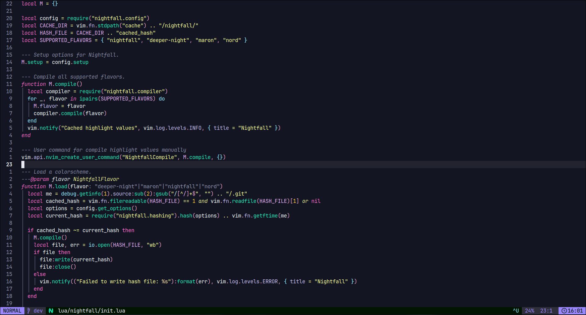
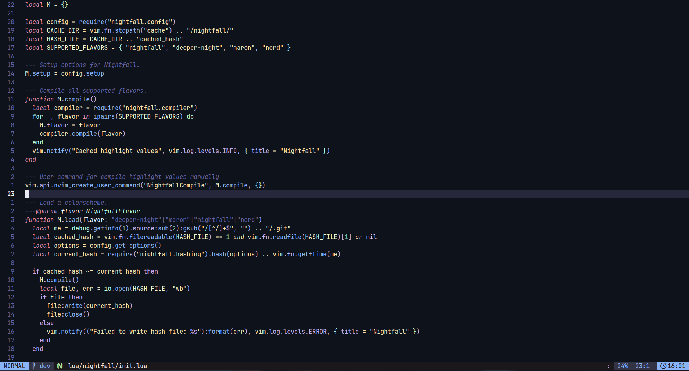
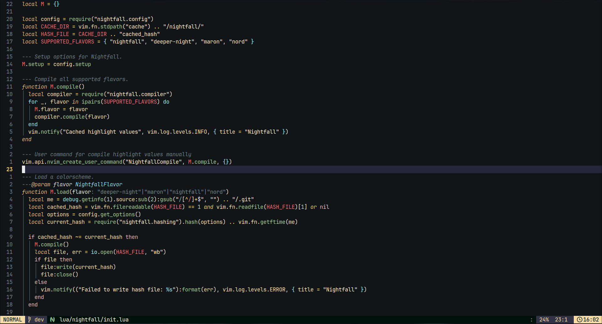
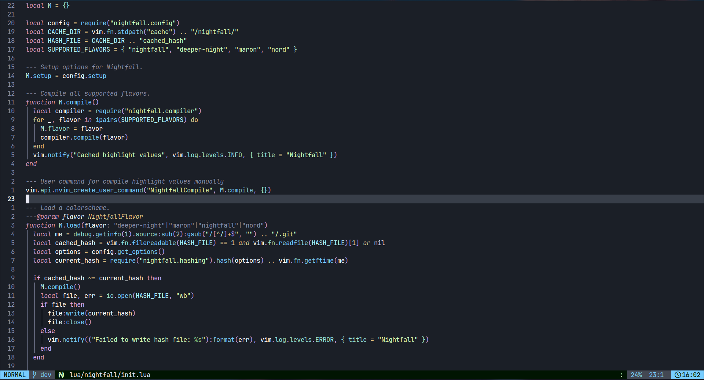
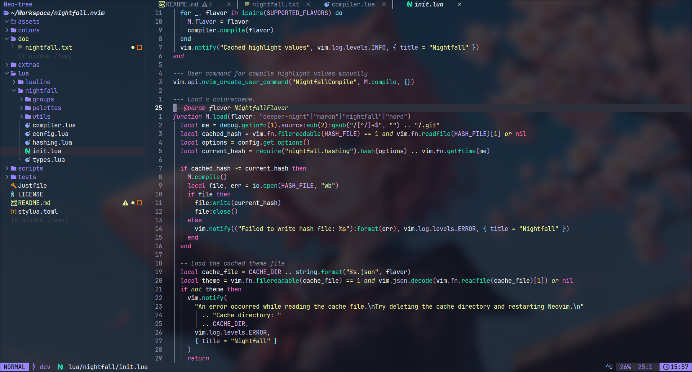
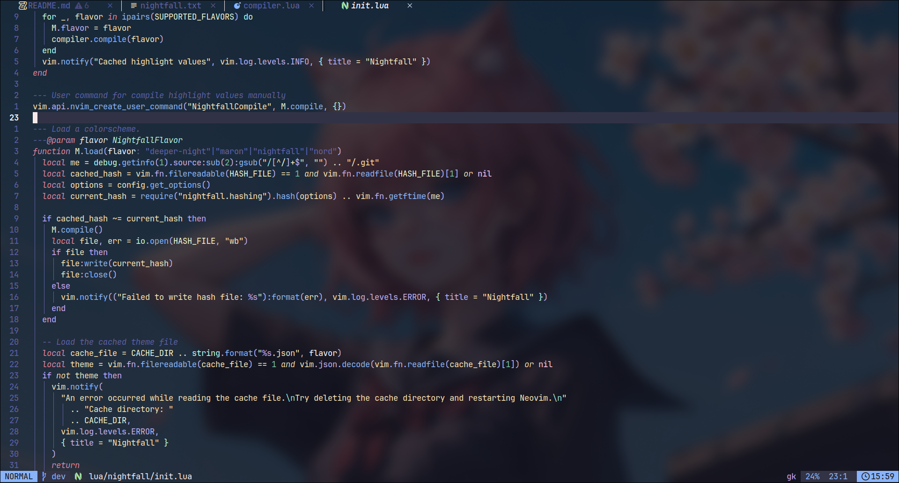
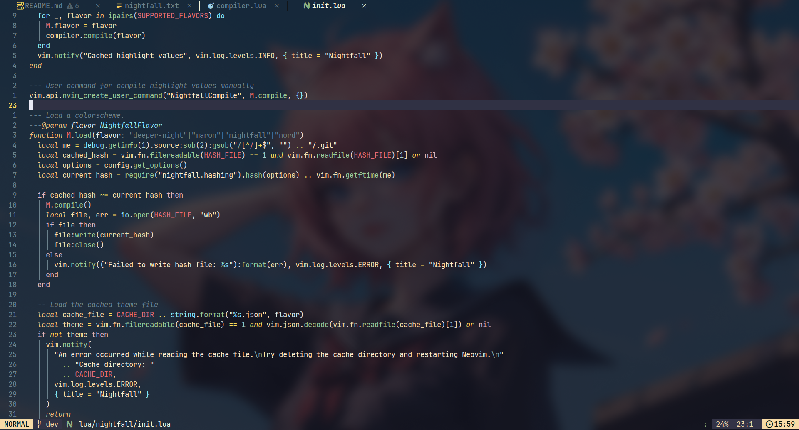
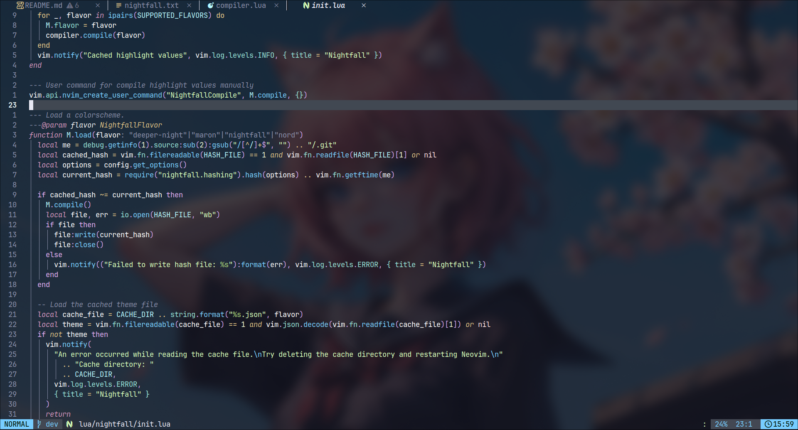

# 🌆 Nightfall.nvim

_Nightfall.nvim_ is a clean and eye-friendly Neovim colorscheme designed to enhance your coding experience. With a minimalist aesthetic and multiple flavors, it reduces eye strain and integrates seamlessly with popular plugins, making it perfect for extended coding sessions.


## ✨ Features

- ⚡️ Automatic caching for faster load times.
- 🌲 Full Treesitter support for enhanced syntax highlighting.
- 🎟️ LSP semantic token integration.
- 🧩 Compatible with major plugins.
- 🖌️ Highly customizable to fit your preferences.
- 🏵 Designed to reduce eye strain.
- 🪁 Multiple flavors to match your style.
- 🍗 Minimalist design for improved readability.

## 🎨 Preview

<details open>
<summary>Click to toggle preview</summary>

### Nightfall



### Deeper Night



### Maron



### Nord



### Transparent Themes

#### Transparent Nightfall



#### Transparent Deeper Night



#### Transparent Maron



#### Transparent Nord



</details>

## 🚀 Installation

Install Nightfall.nvim using your favorite Neovim plugin manager.

With [lazy.nvim](https://github.com/folke/lazy.nvim):

```lua
{
  "2giosangmitom/nightfall.nvim",
  lazy = false,
  priority = 1000,
  opts = {}, -- Add custom configuration here
  config = function(_, opts)
    require("nightfall").setup(opts)
    vim.cmd("colorscheme nightfall") -- Choose from: nightfall, deeper-night, maron, nord
  end,
}
```

## 🎨 Customization

Nightfall.nvim allows overriding colors and highlights to suit your needs. Refer to `:h nightfall_overriding` for details.

```lua
require("nightfall").setup({
  color_overrides = {
    all = { foreground = "#ffffff" },
    nightfall = { background = "#ff0000" },
  },
  highlight_overrides = {
    all = {
      Normal = { bg = "#120809" },
    },
    nightfall = function(colors)
      return {
        Normal = { bg = colors.black },
      }
    end,
    maron = {
      Normal = { fg = "#ffffff" },
    },
  },
})
```

## 🛠️ Integrations

Seamlessly integrates with various plugins. Enable or customize integrations as needed:

```lua
require("nightfall").setup({
  integrations = {
    telescope = { enabled = true, style = "borderless" },
    flash = { enabled = false },
  },
})
```

Disable all default integrations:

```lua
require("nightfall").setup({
  default_integrations = false,
})
```

## 🤝 Contributing

We welcome contributions! Whether fixing bugs, adding features, or improving documentation, your help is valuable.

### Steps to Contribute

1. Clone the repository.
2. Load the plugin locally.
3. Create a new branch and start coding.

For lazy.nvim users, use the following setup for local development:

```lua
local augroup = vim.api.nvim_create_augroup("nightfall_dev", { clear = true })

vim.api.nvim_create_autocmd("BufWritePost", {
  pattern = "*/lua/nightfall/**.lua",
  group = augroup,
  callback = function()
    for pack, _ in pairs(package.loaded) do
      if pack:match("^nightfall") then package.loaded[pack] = nil end
    end

    local nightfall = require("nightfall")
    nightfall.setup({ transparent = false })
    nightfall.compile()
    vim.cmd.colorscheme(vim.g.colors_name)
    vim.notify("Nightfall reloaded", vim.log.levels.INFO, { title = "Nightfall" })
  end,
})

return {} -- You can add more lazy.nvim specs here
```

## ❤️ Support

Enjoying Nightfall.nvim? Give it a 🌟 on GitHub and share it with others!

## 📜 License

Licensed under the [MIT License](LICENSE).

## 🎖️ Acknowledgments

Nightfall.nvim owes gratitude to the following projects for their inspiration and contributions:

- [Onedark Pro](https://github.com/olimorris/onedarkpro.nvim)
- [Catppuccin](https://github.com/catppuccin/nvim)
- [Nightfox](https://github.com/EdenEast/nightfox.nvim)
- [Tokyonight](https://github.com/folke/tokyonight.nvim)
