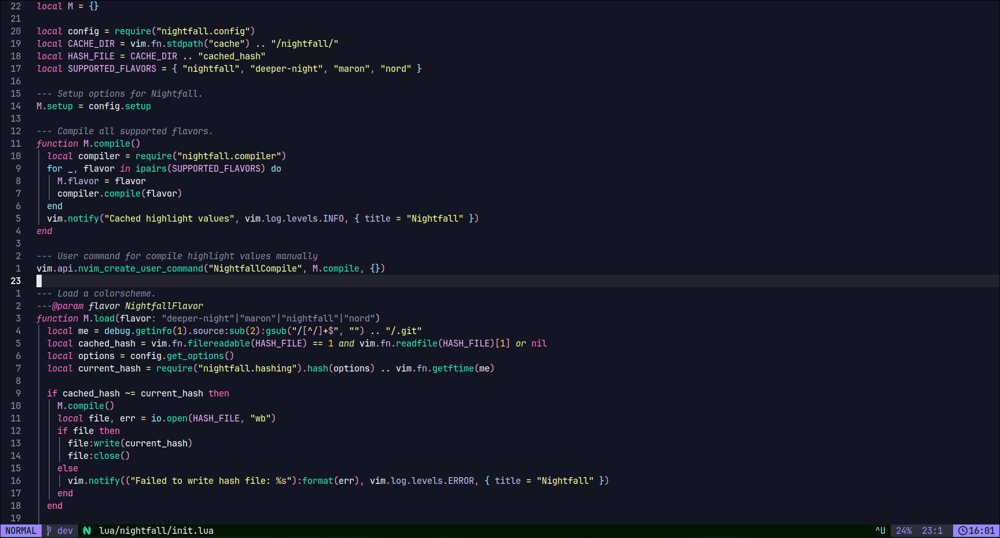
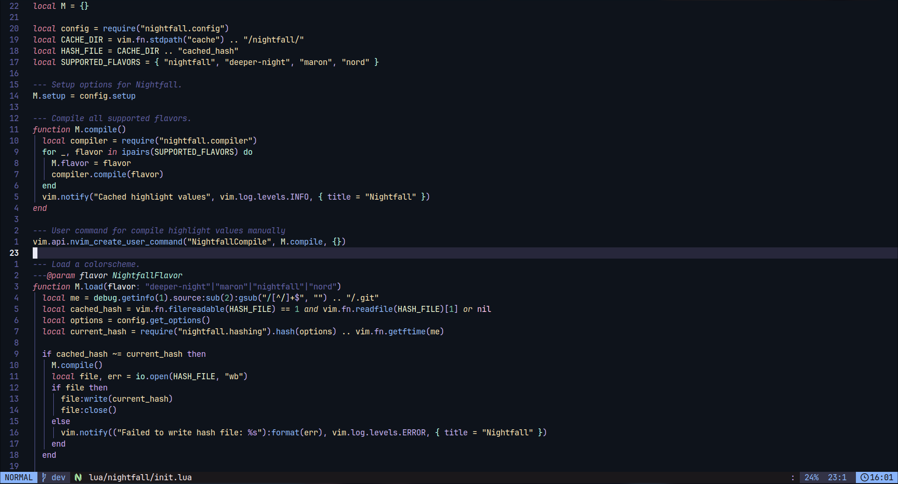
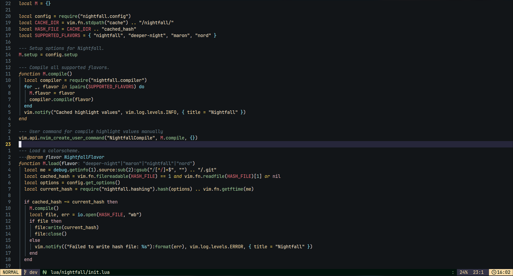
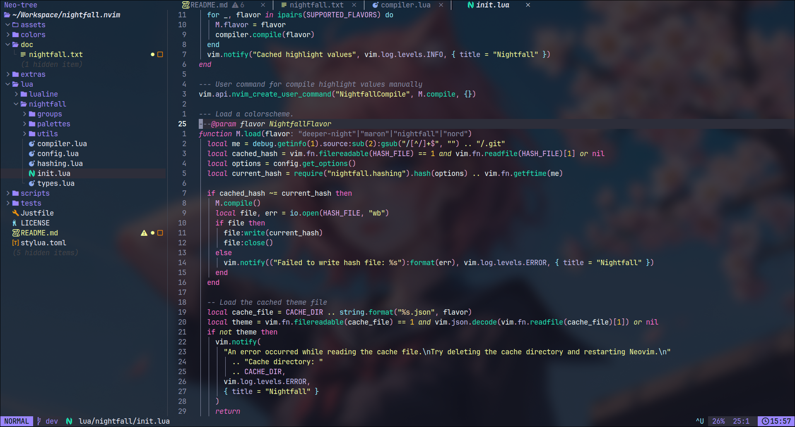
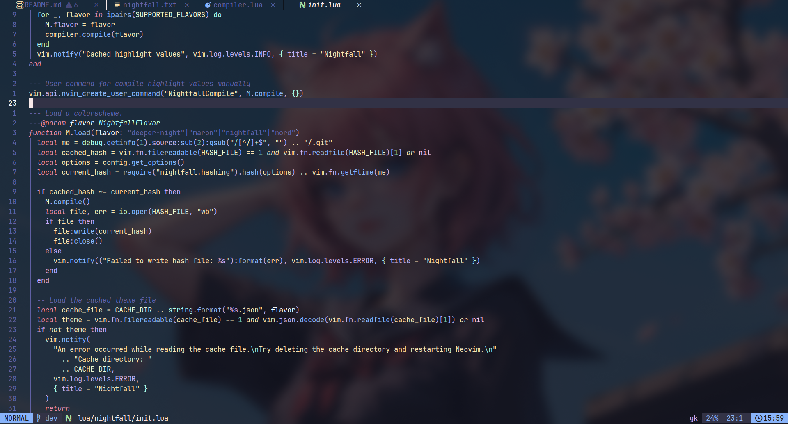
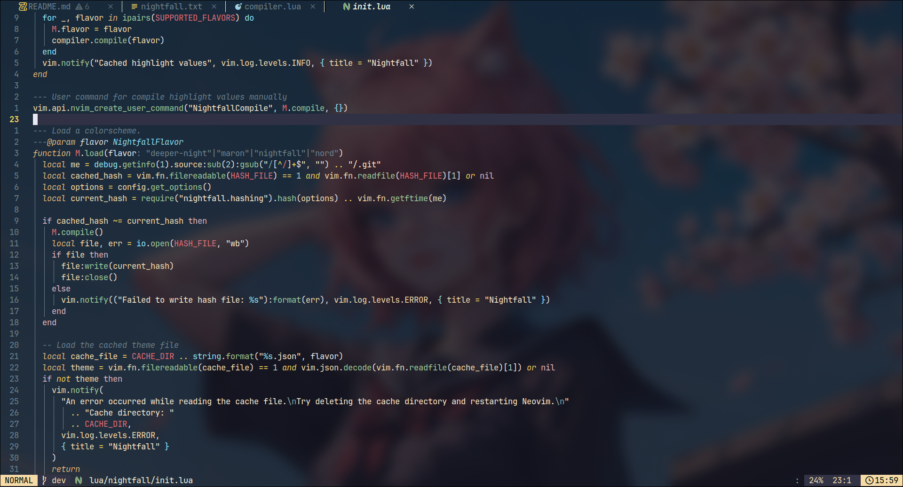

# 🌆 Nightfall.nvim

_Nightfall.nvim_ is a clean and eye-friendly Neovim colorscheme designed to enhance your coding experience. With a minimalist aesthetic and multiple flavors, it reduces eye strain and integrates seamlessly with popular plugins, making it perfect for extended coding sessions.


## ✨ Features

- 🪁 Three flavors that all cover the same highlight groups.
- 🌲 Full Treesitter support for enhanced syntax highlighting.
- 🎟️ LSP diagnostics and semantic token integration.
- 🧩 Sixteen plugin integrations, each one switchable.
- 🖌️ Colors and highlight groups you can override per flavor.
- ⚡️ Compiled once and reused, so startup stays fast.
- 🏵 Designed to reduce eye strain.
- 🖥️ Matching themes for Alacritty, lazygit and yazi.

## 🎨 Preview

<details open>
<summary>Click to toggle preview</summary>

### Nightfall



### Deeper Night



### Maron



### Transparent Themes

#### Transparent Nightfall



#### Transparent Deeper Night



#### Transparent Maron



</details>

## 🚀 Installation

Install Nightfall.nvim with your favourite plugin manager. Calling `setup` is optional; without it every option keeps its default.

With [lazy.nvim](https://github.com/folke/lazy.nvim):

```lua
{
  "2giosangmitom/nightfall.nvim",
  lazy = false,
  priority = 1000,
  opts = {},
  config = function(_, opts)
    require("nightfall").setup(opts)
    vim.cmd.colorscheme("nightfall") -- nightfall, deeper-night, maron
  end,
}
```

`setup` has to run before `:colorscheme` for its options to take effect.

## ⚙️ Options

```lua
require("nightfall").setup({
  transparent = false,          -- skip backgrounds so the terminal shows through
  terminal_colors = true,       -- set the terminal_color_* globals
  dim_inactive = false,         -- darken windows without the cursor
  default_integrations = true,  -- start from every integration enabled
  styles = { comments = { italic = true } },
  integrations = { flash = { enabled = false } },
  color_overrides = {},
  highlight_overrides = {},
})
```

See `:h nightfall-config` for the full list and every default.

## 🎨 Customization

`color_overrides` replaces palette colors before highlights are built, so a replaced color reaches every group that uses it. `highlight_overrides` replaces highlight groups afterwards. Both are keyed by flavor name, or by `all` for every flavor, and a flavor's own entry wins over `all`. An entry of `highlight_overrides` is a table of groups, or a function that receives the palette and returns one.

```lua
require("nightfall").setup({
  color_overrides = {
    all = { fg = "#ffffff" },
    nightfall = { bg = "#0b0b14" },
  },
  highlight_overrides = {
    all = { Normal = { bg = "#120809" } },
    nightfall = function(colors)
      return { Comment = { fg = colors.teal, italic = false } }
    end,
  },
})
```

Only the keys you name change; the rest of a group keeps the value the colorscheme gave it. See `:h nightfall-config` for details.

## 🛠️ Integrations

Every integration is on by default and takes at least `enabled`. Some take more: `fzf` and `telescope` accept a `style` of `"bordered"` or `"borderless"`, and `mini`, `snacks`, `native_lsp` and `treesitter` have a switch per feature.

```lua
require("nightfall").setup({
  integrations = {
    telescope = { enabled = true, style = "borderless" },
    treesitter = { enabled = true, context = true },
    flash = { enabled = false },
  },
})
```

Set `default_integrations = false` to start from none of them and opt back in one at a time.

Supported: blink.cmp, flash.nvim, fzf-lua, indent-blankline.nvim, lazy.nvim, mason.nvim, mini.nvim, Neovim diagnostics and semantic tokens, neo-tree.nvim, noice.nvim, nvim-cmp, render-markdown.nvim, snacks.nvim, telescope.nvim, Treesitter, which-key.nvim.

### lualine

A matching [lualine](https://github.com/nvim-lualine/lualine.nvim) theme ships with each flavor:

```lua
require("lualine").setup({ options = { theme = "nightfall" } })
```

## 🖥️ Beyond Neovim

The `extras/` directory carries matching themes for other tools, one file per flavor, generated from the same palettes.

| Tool                                                  | Where it goes                                                             |
| ----------------------------------------------------- | ------------------------------------------------------------------------- |
| [Alacritty](https://alacritty.org)                    | Import `extras/alacritty/<flavor>.toml` from `alacritty.toml`              |
| [lazygit](https://github.com/jesseduffield/lazygit)   | Merge `extras/lazygit/<flavor>.yaml` into your lazygit config              |
| [yazi](https://yazi-rs.github.io)                     | Copy `extras/yazi/<flavor>.toml` to `~/.config/yazi/theme.toml`            |

## 🤝 Contributing

Contributions are welcome, whether they fix bugs, add an integration or improve the documentation.

The repository uses [just](https://github.com/casey/just) for every task:

```sh
just deps      # clone mini.test and mini.doc into deps/
just test      # run the test suite
just fmt       # format with stylua
just generate  # regenerate doc/nightfall.txt and extras/
just ci        # everything the CI runs
```

`doc/nightfall.txt` and everything under `extras/` are generated, so change the source and run `just generate` rather than editing them by hand. CI fails if either is out of date.

Adding an integration means one file at `lua/nightfall/groups/integrations/<name>.lua`, exporting `get(ctx, opts)`, plus an entry named `<name>` in the defaults in `lua/nightfall/config.lua`.

For local development, set `vim.g.nightfall_no_cache = true` so every reload rebuilds the theme, and reload the plugin on save:

```lua
vim.g.nightfall_no_cache = true

vim.api.nvim_create_autocmd("BufWritePost", {
  pattern = "*/lua/nightfall/**.lua",
  group = vim.api.nvim_create_augroup("nightfall_dev", { clear = true }),
  callback = function()
    for module in pairs(package.loaded) do
      if module:match("^nightfall") then package.loaded[module] = nil end
    end

    require("nightfall").setup({})
    vim.cmd.colorscheme(vim.g.colors_name)
    vim.notify("Nightfall reloaded", vim.log.levels.INFO, { title = "Nightfall" })
  end,
})
```

## ❤️ Support

Enjoying Nightfall.nvim? Give it a 🌟 on GitHub and share it with others!

## 📜 License

This project is licensed under the [MIT License](LICENSE).

Thanks to all the amazing [contributors](https://github.com/2giosangmitom/nightfall.nvim/graphs/contributors) 💛

[](https://github.com/2giosangmitom/nightfall.nvim/graphs/contributors)

## 🎖️ Acknowledgments

Nightfall.nvim owes gratitude to the following projects for their inspiration and contributions:

- [Onedark Pro](https://github.com/olimorris/onedarkpro.nvim)
- [Catppuccin](https://github.com/catppuccin/nvim)
- [Nightfox](https://github.com/EdenEast/nightfox.nvim)
- [Tokyonight](https://github.com/folke/tokyonight.nvim)
